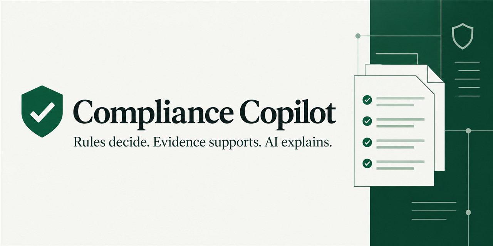
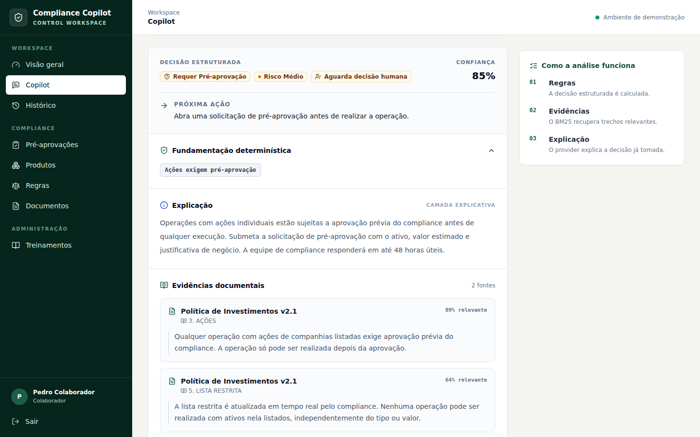
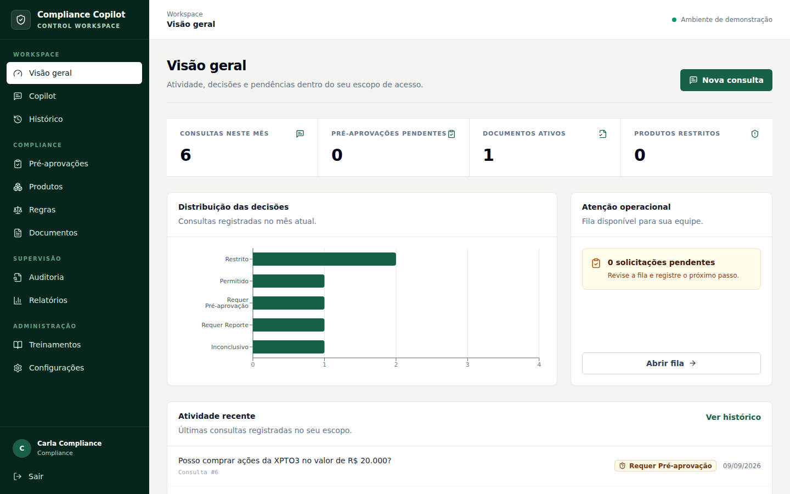
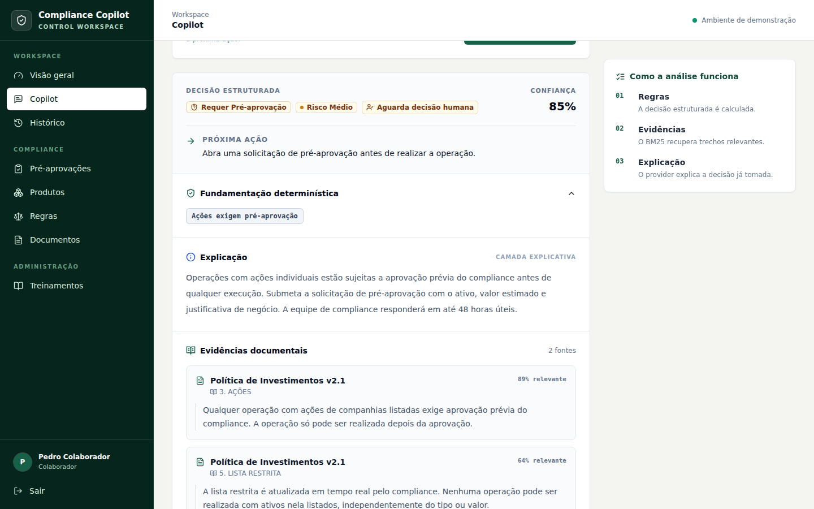
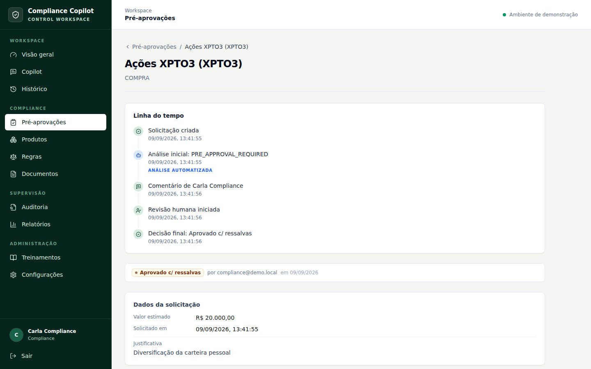
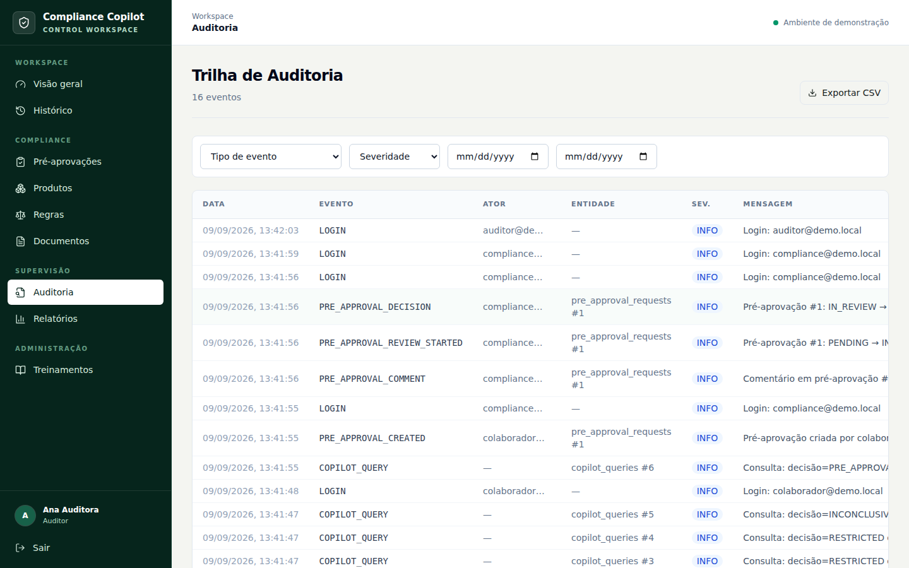

# Compliance Copilot

> Auditable compliance decision support combining deterministic rules,
> documentary evidence, and human approval workflows.

Compliance Copilot turns the question “may I execute this financial operation?”
into a structured, traceable result. The application is in Portuguese; this
project documentation uses English for a broader technical audience.



## The problem

Employees at investment firms often need to search policy documents, identify
product restrictions, interpret thresholds, and preserve a record before they
can trade. A generic chatbot can summarize text, but it cannot provide the
deterministic precedence, workflow controls, or auditability this process needs.

Compliance Copilot brings those steps into one internal workspace. It resolves
the product, applies hard restrictions and configured rules, attaches relevant
policy excerpts, and routes operations that need a person to a formal
pre-approval workflow.

## The core idea

**Rules decide. Retrieval provides evidence. AI explains. Humans approve when
required. Everything important is auditable.**

The LLM never selects or changes the structured decision. Hard restrictions and
the rules engine are authoritative. Offline retrieval uses deterministic lexical
BM25; optional OpenAI embeddings can refine ranking, and the provider can only
explain the decision it receives. Missing applicable rules fail closed as
`INCONCLUSIVE`.



## How it works

```text
Operation question
       ↓
Structured product resolution
       ↓
Product status + restricted list ── terminal when restricted
       ↓
Deterministic rules engine ──────── authoritative decision
       ├── BM25 documentary retrieval ── supporting evidence
       └── mock/OpenAI provider ───────── explanation only
       ↓
Pre-approval when required
       ↓
Persisted timeline + audit trail
```

## Product walkthrough

### Operational overview

Role-scoped metrics, decision distribution, pending work, and recent activity
give Compliance a concise view of the current operating state.



### Decision support

The Copilot combines structured context with deterministic compliance rules
before any AI-generated explanation, as shown in the decision workflow above.

### Documentary evidence

Retrieved policy excerpts remain separate from the structured decision and
expose document metadata and relevance.



### Human approval workflow

Operations requiring approval move into a traceable human review process with
comments, timestamps, an initial decision snapshot, and a final opinion.



### Auditability

Relevant actions remain available to authorized oversight roles through the
audit trail.



The canonical demo covers all five decisions and the absence-of-policy path:

| Scenario | Expected result |
|---|---|
| Open fund below R$ 100,000 | `ALLOWED` |
| Open fund above R$ 100,000 | `REPORT_REQUIRED` |
| `XPTO3` stock purchase | `PRE_APPROVAL_REQUIRED` |
| `ACME3` on the restricted list | `RESTRICTED` |
| Cryptocurrency | `RESTRICTED` |
| Fixed-income product with no applicable rule | `INCONCLUSIVE` |

All screenshots come from the current application running against PostgreSQL
with the repository's official fictional seed data.

## Key features

- Deterministic rule evaluation with strict numeric priority.
- Terminal product-status and restricted-list checks.
- Canonical product resolution without ambiguous fallback.
- PDF, DOCX, and TXT ingestion with page and section metadata.
- Deterministic BM25 retrieval with an explicit relevance gate.
- Optional OpenAI explanation and embedding refinement.
- Linked pre-approval workflow with comments and a guarded state machine.
- Role-based access for Admin, Compliance, Employee, and read-only Auditor.
- Role-scoped dashboard, reports, history, and append-only audit trail.
- Reproducible Docker images, Alembic bootstrap, and Linux CI.

## Architecture

- **Backend:** Python 3.12, FastAPI, SQLAlchemy 2, Alembic, Pydantic 2.
- **Frontend:** Next.js 14, React 18, TypeScript, Tailwind CSS, TanStack Query.
- **Data:** PostgreSQL 16; isolated SQLite databases are used by tests only.
- **Retrieval:** in-process BM25 plus optional real-provider embeddings stored as
  JSONB. The project does not claim pgvector or a vector database.
- **Infrastructure:** Docker Compose and GitHub Actions.

See [Architecture](docs/ARCHITECTURE.md) for the boundaries and data flow.

## Quick start

Requirements: Git and Docker with Docker Compose.

```bash
git clone https://github.com/esportellini/compliance-copilot.git
cd compliance-copilot
cp .env.example .env
docker compose up --build
```

On PowerShell, replace `cp .env.example .env` with:

```powershell
Copy-Item .env.example .env
```

The official Compose flow waits for PostgreSQL, runs `alembic upgrade head`,
starts the backend, waits for its health check, and then starts the frontend.
Migration failure prevents backend startup. Seed data remains an explicit step:

```bash
docker compose exec backend python -m app.seed
```

Open the app at <http://localhost:3000>, Swagger UI at
<http://localhost:8000/docs>, and the health endpoint at
<http://localhost:8000/health>.

Alembic is the only schema source for application databases. The seed assumes a
migrated schema and performs deterministic upserts. Direct
`Base.metadata.create_all` use is confined to isolated SQLite test setup.

## Demo accounts

All accounts use the public demo password `Compliance123!`.

| Account | Role |
|---|---|
| `admin@demo.local` | Admin |
| `compliance@demo.local` | Compliance |
| `colaborador@demo.local` | Employee |
| `auditor@demo.local` | Auditor, read-only |

These credentials and all seeded records are fictional and intentionally
insecure. Never reuse them outside the local demo.

## Demo walkthrough

1. Sign in as `colaborador@demo.local`.
2. Ask whether you may buy `XPTO3` for R$ 20,000.
3. Inspect `PRE_APPROVAL_REQUIRED`, its matched rule, and policy evidence.
4. Open the linked request, choose the operation type, and submit it.
5. Sign in as `compliance@demo.local`, start review, comment, and record a final
   opinion or conditions.
6. Return as the Employee to inspect the outcome, then sign in as
   `auditor@demo.local` to inspect the append-only audit trail without mutation
   controls.

## Tests and quality

The release has **135 backend tests**. The suite verifies decision semantics,
retrieval fallbacks, product resolution, API metadata, RBAC, approval state
transitions, isolation, deterministic seed behavior, and Alembic/model parity.

```bash
cd backend
python -m venv .venv
# Windows: .venv\Scripts\python -m pip install -r requirements-dev.txt
# macOS/Linux: .venv/bin/python -m pip install -r requirements-dev.txt
python -m pytest -q
python -m compileall -q app alembic
```

```bash
cd frontend
npm ci
npm run typecheck
npm run lint
npm run build
```

GitHub Actions runs the backend suite, Alembic schema and PostgreSQL offline-SQL
checks, Compose configuration validation, typecheck, lint, and the complete
Next.js production build on Linux for every push and pull request.

## Design decisions

- [Product boundaries](PRODUCT.md)
- [Interface system](DESIGN.md)
- [Architecture](docs/ARCHITECTURE.md)
- [Rule engine](docs/RULE_ENGINE.md)
- [RAG pipeline](docs/RAG_PIPELINE.md)
- [Security and RBAC](docs/SECURITY.md)
- [API overview](docs/API_OVERVIEW.md)
- [LGPD and privacy](docs/LGPD_AND_PRIVACY.md)
- [Product case](docs/PRODUCT_CASE.md)

## Limitations

- This is an educational portfolio project with fictional policies and data.
- There is no rate limiting, MFA, SSO, notification service, or multi-tenancy.
- Optional embeddings are stored as JSONB and ranked in process.
- PDF extraction requires selectable text; OCR is not implemented.
- Copilot-query retention is not automated.
- A real deployment requires independent security, privacy, legal, and
  compliance review.

## Roadmap

Possible next steps include notifications, enterprise identity controls,
multi-tenant isolation, and external restricted-list integrations. They are
documented in the short [roadmap](docs/ROADMAP.md) and are outside this release.

## Disclaimer

Compliance Copilot is an educational and portfolio project. It is not legal,
regulatory, financial, or investment advice and is not production-certified.

## License

Released under the [MIT License](LICENSE). Copyright © 2026 Enzo.
